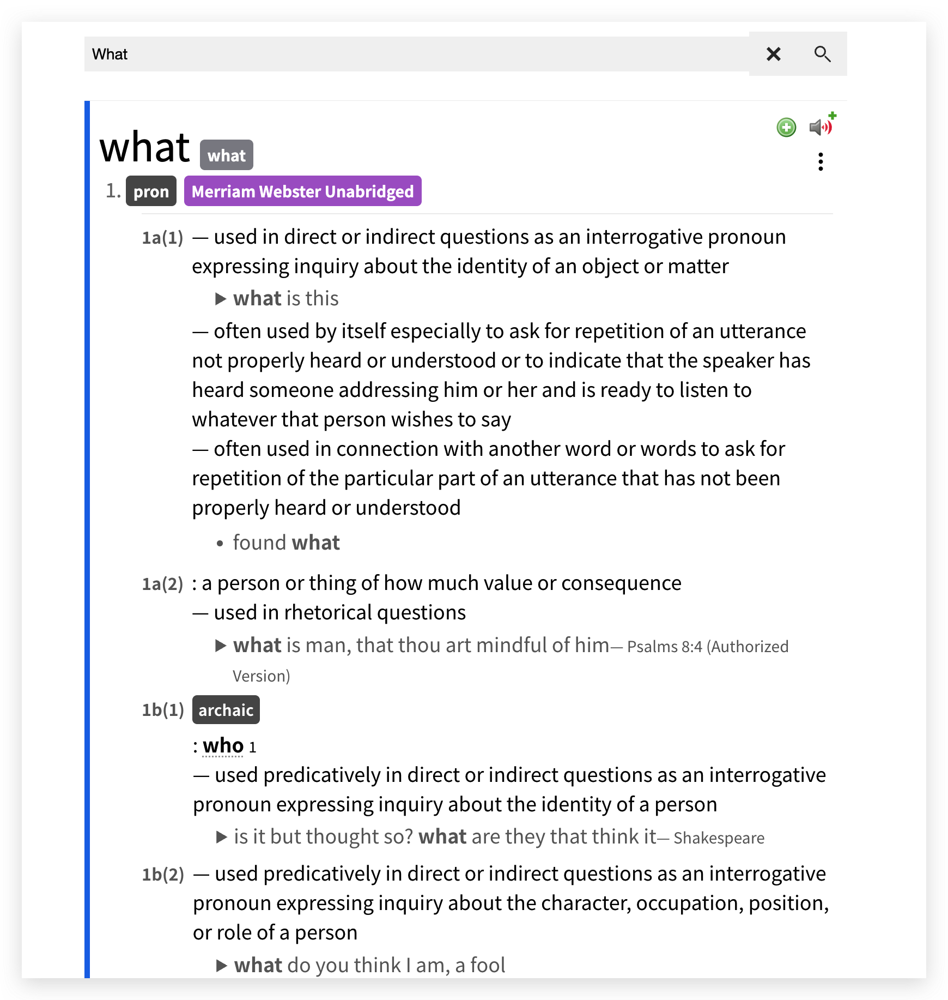
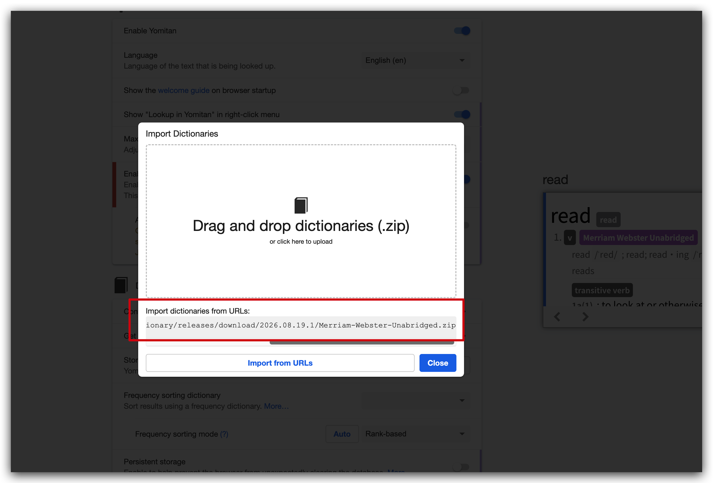

# Birudo's Yomitan Dictionaries

## Dictionary List

### Merriam Webster Unabridged

Convert [Merriam-Webster Unabridged 2024 MDX source](https://huggingface.co/buckets/Birudo/yomitan-dict-source-data/tree/source/Merriam-Webster-Unabridged-2024-MDX.7z) into a Yomitan dictionary.

The dictionary preserves definitions, pronunciation text, part-of-speech labels,
examples, phrases, and origin information when the source provides them.
Pronunciation audio, illustrations, and tables are not included.

Origin MDX screenshot:

Converted Yomitan dictionary: 

I tried my best to retain as much information from the original dictionary.

### Install

Method 1: You can download it from the [release page](https://github.com/BilderLoong/yomitan-dictionary/releases) then import into Yomitan dictionary.

Method 2: You can also use download URL of the dictionary into Yomitan 

```text
https://github.com/BilderLoong/yomitan-dictionary/releases/latest/download/Merriam-Webster-Unabridged.zip
```

.


### Usage

Cause I don't map all every part-of-speech tag into deinflection rule tag for each entry. 

So I highly recommend you toggle the `Part of speech filtering` off which is default on, so that you can get the deinflection work with this dictionary.
 


## Feedback

Feel free to open a issue if encounter any problem when using this dictionary. I very happy to keep improve it.

## Other yomitan dictionaries

- [MarvNC/yomitan-dictionaries: 📚 Japanese and Chinese dictionaries for Yomitan.](https://github.com/MarvNC/yomitan-dictionaries)
- [yomidevs/wiktionary-to-yomitan: Yomitan-compatible dictionaries from wikitionary data](https://github.com/yomidevs/wiktionary-to-yomitan)
- [shoujocyber/OALD10-Yomitan-Converter: An advanced Python script to deeply parse, clean, and restructure the OALD (10th Ed) MDX data into a highly optimized, native Yomitan/Yomichan JSON dictionary.](https://github.com/shoujocyber/OALD10-Yomitan-Converter)
- [1Selxo/living-japanese-slang-dictionary: daily Updated living-japanese-slang-dictionary Conversions for yomitan](https://github.com/1Selxo/living-japanese-slang-dictionary/tree/521e0cb19d7f64fe2d0af0a9d93b78329f5ccfe6)
- [W1ght/ninjal-bunkei-yomitan: Yomitan dictionary for NINJAL Nihongo Bunkei Database 2026.01](https://github.com/W1ght/ninjal-bunkei-yomitan)
- [HuangAntimony/Nihongo-Bunkei-Jiten: Japanese grammar dictionary rebuilt from mefat.review for Yomitan](https://github.com/HuangAntimony/Nihongo-Bunkei-Jiten)

## Credit

- [yomidevs/wiktionary-to-yomitan: Yomitan-compatible dictionaries from wikitionary data](https://github.com/yomidevs/wiktionary-to-yomitan)